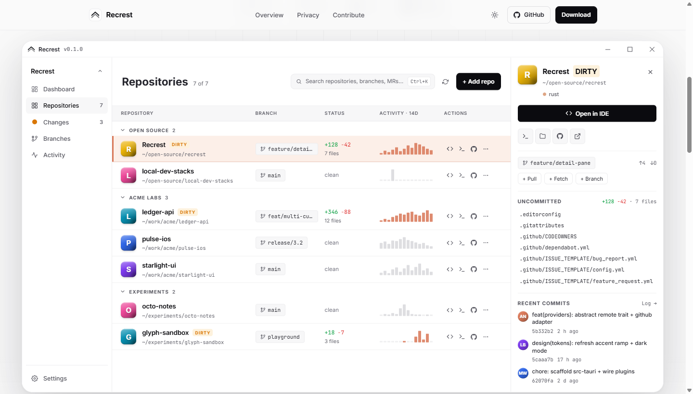

<div align="center">

# Recrest

**All your local git repos. In one calm, native dashboard.**

A lightweight desktop app that surfaces every local repository on your
machine, its working-tree status, open pull requests, and CI checks —
without juggling a browser, a terminal, and three Electron apps.

[](./LICENSE)
[](https://softventures.github.io/Recrest/)
[](https://tauri.app)
[](./ACCESSIBILITY.md)



</div>

---

## Highlights

- **Local-first.** Recrest reads your repositories directly from disk. Nothing
  leaves your machine unless you open a remote PR — no telemetry, no cloud
  sync, no Recrest server.
- **Native & tiny.** Rust + Tauri core, ~12 MB bundle, under 80 MB RAM at
  idle. Not Electron.
- **Works offline.** The local status keeps updating while you work; remote
  state resumes automatically when you reconnect.
- **Tokens stay in the OS keychain.** macOS Keychain, Windows Credential
  Manager, libsecret on Linux. Never on disk.
- **Keyboard-first.** `Ctrl/Cmd + K` opens the command palette. Everything
  else is one key away.
- **i18n.** English and German ship with v0.1. OS locale is auto-detected.
- **Light / dark / system theme.** Persisted across restarts.
- **Accessible.** Meets [WCAG 2.1 AA](./ACCESSIBILITY.md); tested on every
  commit.

## Providers (v0.1)

| Provider  | Status        | Tokens       | PRs  | CI checks |
| --------- | ------------- | ------------ | ---- | --------- |
| GitHub    | ✅ Supported  | PAT          | ✅   | ✅        |
| GitLab    | 🧪 Scaffolded | PAT          | Soon | Soon      |
| Bitbucket | 🧪 Scaffolded | App Password | Soon | Soon      |

The provider layer lives behind a narrow async trait
(`src-tauri/src/providers/r#trait.rs`) so adding a new host or swapping in a
WASM-plugin implementation later is a drop-in.

---

## Download & install

Pre-built installers for every tagged release live on the
[Releases page](https://github.com/SoftVentures/Recrest/releases/latest).
Pick the file for your platform:

| Platform                                | File                               |
| --------------------------------------- | ---------------------------------- |
| macOS (Apple Silicon + Intel universal) | `Recrest_<version>_universal.dmg`  |
| Windows 10 / 11 (x64)                   | `Recrest_<version>_x64-setup.msi`  |
| Linux (most distros)                    | `Recrest_<version>_amd64.AppImage` |
| Debian / Ubuntu                         | `Recrest_<version>_amd64.deb`      |
| Fedora / RHEL                           | `Recrest_<version>-1.x86_64.rpm`   |

> **Heads up:** Recrest is **not code-signed yet.**
> Apple Developer IDs cost USD 99/year and a Windows EV certificate starts at
> USD 300+/year — we're an unfunded open-source project and can't carry that
> bill yet. The installers are built directly from the tagged source on
> GitHub Actions; you can read every line of the pipeline in
> [`.github/workflows/release-tauri.yml`](./.github/workflows/release-tauri.yml)
> and verify every artifact against `SHA256SUMS.txt`.

### Installing on Windows

1. Download the `.msi` from the Releases page.
2. Double-click to launch the installer.
3. Windows SmartScreen will say "**Windows protected your PC — Unknown
   publisher**." That's the unsigned-installer warning, not malware.
4. Click **More info** → **Run anyway**.

The warning goes away once enough users run Recrest and Microsoft's
reputation system catches up — or once we can afford a signing cert.

### Installing on macOS

1. Open the `.dmg` and drag **Recrest.app** into Applications.
2. First launch: Gatekeeper will block the app with "_Recrest can't be
   opened because the developer cannot be verified._"
3. Two ways to allow it:
   - **In Finder:** right-click (or `Ctrl`-click) **Recrest.app** →
     **Open**. Confirm in the dialog. macOS remembers the choice.
   - **In Terminal:**

     ```bash
     xattr -cr /Applications/Recrest.app
     ```

### Installing on Linux

- **AppImage:**

  ```bash
  chmod +x Recrest_*.AppImage
  ./Recrest_*.AppImage
  ```

- **deb:**

  ```bash
  sudo apt install ./Recrest_*_amd64.deb
  ```

- **rpm:**

  ```bash
  sudo dnf install ./Recrest_*-1.x86_64.rpm
  ```

No signature prompts — Linux simply trusts the repo you installed from.

### Verify your download (optional, recommended)

Every release ships a `SHA256SUMS.txt` next to the installers. Verify it:

```bash
# macOS / Linux
shasum -a 256 -c SHA256SUMS.txt

# Windows PowerShell
Get-FileHash Recrest_*.msi -Algorithm SHA256
```

If a line comes back as _FAILED_, stop and re-download. Don't run anything
whose checksum doesn't match.

---

## Build from source

If you prefer to build it yourself (and never see an OS warning):

### Prerequisites

- **Node.js ≥ 22.20** — `.nvmrc` pins the exact version.
- **Yarn 1.x** — `npm i -g yarn`.
- **Rust toolchain (stable)** — required for the desktop build. Skip only
  if you're iterating on UI with `yarn dev:web`.
- **Platform dependencies for Tauri** —
  see [tauri.app/start/prerequisites](https://tauri.app/start/prerequisites/).

### Clone, install, run

```bash
git clone https://github.com/SoftVentures/Recrest.git
cd Recrest
yarn install        # shared workspace builds automatically via postinstall
yarn dev            # full Tauri shell
```

For UI-only iteration (no Rust toolchain needed):

```bash
yarn dev:web        # Vite dev server at http://localhost:3000
```

IPC calls no-op gracefully outside the Tauri runtime, so the app renders
and routes work in a plain browser.

### Production bundle

```bash
yarn build          # Tauri installer for your platform, in app/src-tauri/target/release/bundle/
```

---

## Tech stack

| Layer         | Choice                                                                                                                                                                                              |
| ------------- | --------------------------------------------------------------------------------------------------------------------------------------------------------------------------------------------------- |
| Desktop shell | [Tauri v2](https://tauri.app)                                                                                                                                                                       |
| Frontend      | React 19 · TypeScript (strict) · Tailwind CSS v4 · shadcn-style primitives · lucide-react                                                                                                           |
| State         | Redux Toolkit + react-redux                                                                                                                                                                         |
| i18n          | [react-i18next](https://react.i18next.com)                                                                                                                                                          |
| Backend       | Rust — [`git2`](https://crates.io/crates/git2) (libgit2), [`notify`](https://crates.io/crates/notify), [`reqwest`](https://crates.io/crates/reqwest), [`keyring`](https://crates.io/crates/keyring) |
| Responsive    | [`device-type-detection`](https://www.npmjs.com/package/device-type-detection)                                                                                                                      |
| Build         | Vite 5 · Yarn 1.x workspaces                                                                                                                                                                        |
| Tests         | Vitest (unit/component) · Playwright (E2E) · axe-core (a11y)                                                                                                                                        |

## Project layout

```text
Recrest/
├─ app/              # @recrest/app — React frontend + Rust Tauri backend
│  ├─ src/           # React · Redux · i18n · hooks
│  └─ src-tauri/     # Rust: commands, git, providers, auth, config
├─ shared/           # @recrest/shared — framework-free constants, types, utils
├─ landingpage/      # @recrest/landingpage — marketing site, GitHub Pages
├─ tests/            # @recrest/tests — Playwright E2E suite
└─ docs/
   └─ plans/         # implementation-plan.md — authoritative design
```

Each workspace has its own `CLAUDE.md` with workspace-specific conventions.

## Scripts

All commands run from the repo root via Yarn workspaces — no need to `cd`
into sub-packages.

| Command                  | Purpose                                       |
| ------------------------ | --------------------------------------------- |
| `yarn dev`               | Full Tauri desktop dev shell                  |
| `yarn dev:web`           | Vite dev server only (browser, no Rust)       |
| `yarn build`             | Production Tauri bundle                       |
| `yarn build:landingpage` | Landingpage production bundle                 |
| `yarn test`              | Vitest unit + component tests                 |
| `yarn test:e2e`          | Playwright E2E (needs `yarn dev:web` running) |
| `yarn test:ts`           | Typecheck all workspaces                      |
| `yarn lint`              | ESLint across all workspaces                  |
| `yarn format`            | Prettier with import sorting                  |
| `yarn format:check`      | Verify formatting without writing             |

Single test file:

```bash
yarn workspace @recrest/app test src/store/slices/uiSlice.test.ts
yarn workspace @recrest/tests test:e2e src/e2e/app/01-shell.spec.ts
```

## Configuration

User config is persisted under the OS-standard config directory:

| OS      | Path                                                     |
| ------- | -------------------------------------------------------- |
| Windows | `%APPDATA%\eu.softventures.recrest\`                     |
| macOS   | `~/Library/Application Support/eu.softventures.recrest/` |
| Linux   | `~/.config/eu.softventures.recrest/`                     |

Contents: `settings.json` (scan paths, polling interval, default IDE,
theme, locale, registered repos). **Tokens** live in the OS keychain
under the service `eu.softventures.recrest` — never in a plain file.

---

## Accessibility, privacy, legal

- [`ACCESSIBILITY.md`](./ACCESSIBILITY.md) — WCAG 2.1 AA conformance,
  how we test, how to report barriers.
- [Privacy section on the landing page](https://softventures.github.io/Recrest/#privacy) —
  what Recrest reads, what it never sends.
- Imprint, privacy policy, accessibility statement (DE/EN) — available on
  the live landing page under the **Legal** footer column.

## Contributing

Before opening a PR, run the full verification locally:

```bash
yarn test:ts && yarn lint && yarn test && yarn format:check
```

Add every new UI string to **both** `en/` and `de/` locale bundles in
`app/src/i18n/locales/`. When you add a Rust IPC command, mirror its
return type as a TypeScript DTO in `@recrest/shared` so the cross-language
contract stays typed on both ends.

Architecture details and conventions live in the `CLAUDE.md` files at the
repo root and in each workspace. Start with
[`docs/plans/implementation-plan.md`](./docs/plans/implementation-plan.md)
— that's the source of truth when plan and code diverge.

See [`CONTRIBUTING.md`](./CONTRIBUTING.md) and
[`CODE_OF_CONDUCT.md`](./CODE_OF_CONDUCT.md).

## License

[MIT](./LICENSE) — you can do basically anything with Recrest.
Attribution appreciated, liability disclaimed.

Recrest is an open-source project under
[SoftVentures](https://softventures.de).
